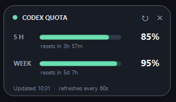

# Codex Quota Widget

> A tiny always-on-top Windows widget for monitoring your Codex 5-hour and weekly quota — no API key required.

[](https://github.com/Wendy12345aa/CodexQuotaWidget/releases)
[](LICENSE)
[](https://github.com/Wendy12345aa/CodexQuotaWidget/releases/latest)



[Download the latest Windows build](https://github.com/Wendy12345aa/CodexQuotaWidget/releases/latest/download/CodexQuotaWidget.exe)

## Features

- Shows the remaining 5-hour and weekly Codex quota
- Displays a countdown to each reset
- Refreshes automatically every 60 seconds
- Borderless, slightly transparent, draggable, and always on top
- Remembers its position and always-on-top preference
- Native WinForms UI with no Electron, Node.js, or WebView
- Uses your existing local Codex sign-in — no OpenAI API key required

## Run

1. Make sure Codex Desktop or Codex CLI is installed and signed in.
2. Download `CodexQuotaWidget.exe` from the [latest release](https://github.com/Wendy12345aa/CodexQuotaWidget/releases/latest).
3. Double-click the EXE and drag the widget wherever you want it.

Use `↻` to refresh and `×` to quit. Right-click the widget to copy the current quota, toggle always-on-top, refresh, or exit.

## How it works and privacy

- Starts the locally installed `codex app-server --stdio` process.
- Reads quota through the local `account/rateLimits/read` method.
- Does not read, copy, or store your login credentials.
- Keeps quota percentages and reset times in memory only.
- Saves only the window position and always-on-top preference in `%LOCALAPPDATA%\CodexQuotaWidget\settings.ini`.

`account/rateLimits/read` is part of the app-server protocol shipped with the local Codex installation. The widget detects support at runtime. Because this is not a documented stable public API, a future Codex update may require a compatibility update to this project.

## Requirements

- Windows 10 or Windows 11
- Codex Desktop or Codex CLI, signed in
- .NET Framework 4.8, normally included with Windows 10/11

## Build from source

The project has no third-party runtime dependencies. Build it using the .NET Framework compiler included with Windows:

```powershell
Set-ExecutionPolicy -Scope Process Bypass
.\build.ps1
```

The output is written to `dist\CodexQuotaWidget.exe`. You can also open `CodexQuotaWidget.csproj` in Visual Studio and build the Release configuration.

To preview the UI without a Codex sign-in:

```powershell
.\dist\CodexQuotaWidget.exe --demo
```

## Troubleshooting

- **Sign in to Codex first** — open Codex Desktop or CLI, sign in, and refresh the widget.
- **Codex not found** — make sure `codex.exe` is in `PATH`, or install Codex Desktop.
- **Update Codex to view quota** — the installed Codex version does not provide the required local method.

## 中文说明

这是一个小巧的 Windows Codex quota 浮窗：无边框、置顶、可拖动，显示 5-hour 与 weekly 剩余额度和重置倒计时。

### 直接运行

1. 确认 Codex Desktop 或 Codex CLI 已安装并登录。
2. 从 [Latest Release](https://github.com/Wendy12345aa/CodexQuotaWidget/releases/latest) 下载 `CodexQuotaWidget.exe`。
3. 双击运行，并把浮窗拖到喜欢的位置。

顶部的 `↻` 可立即刷新，`×` 退出。右键菜单可以复制 quota、切换置顶、刷新或退出。应用每 60 秒自动刷新。

### 数据与隐私

- 不需要 OpenAI API key。
- 不读取、复制或保存登录凭证。
- 通过本机 `codex app-server --stdio` 的 `account/rateLimits/read` 读取 quota。
- 只在内存中保留 quota 百分比与重置时间。
- 只在 `%LOCALAPPDATA%\CodexQuotaWidget\settings.ini` 保存窗口位置与置顶选项。

这个本地接口不是公开的稳定 API，未来 Codex 更新后可能需要同步更新兼容逻辑。

## License

[MIT](LICENSE)
